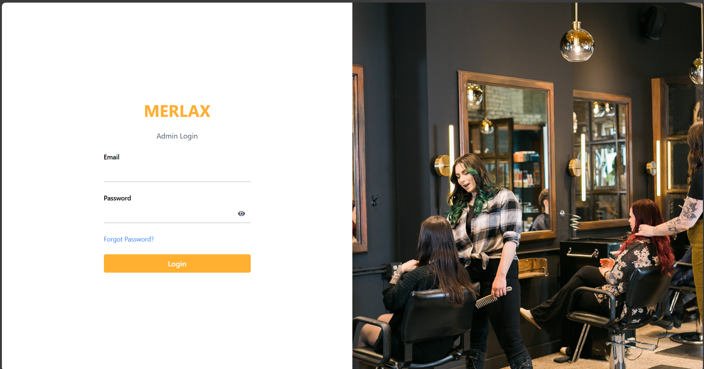
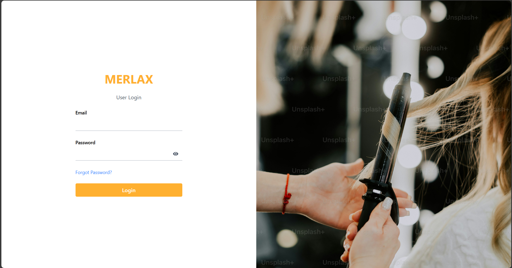
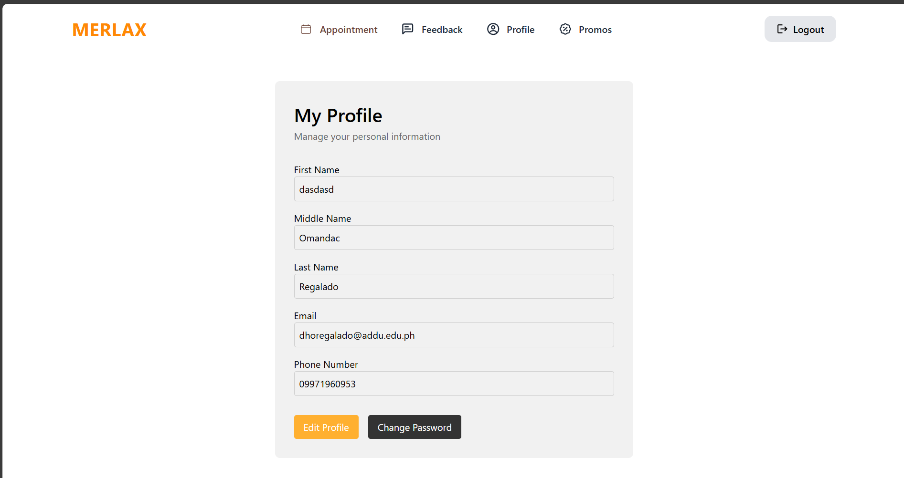

# MERLAX SALON

MERLAX SALON is a modern salon management web application built with React, TypeScript, Vite, and Tailwind CSS. It provides features for both customers and administrators, including appointment booking, feedback, profile management, and service/stylist management.

## Features

- **Customer Portal:**

  - Book appointments
  - View appointment history
  - Manage profile
  - Provide feedback
  - View promotions

- **Admin Portal:**

  - Manage appointments
  - View and manage customers
  - Manage feedback
  - Add/edit services and stylists
  - Secure admin login

- **Authentication:**

  - Role-based access control
  - Password reset functionality

- **Stylist & Service Management:**
  - Add, edit, and view services and stylists

## Tech Stack

- **Frontend:** React, TypeScript, Vite
- **Styling:** Tailwind CSS
- **State Management:** React Context, Custom Hooks
- **Backend/Database:** Supabase (see `lib/supabaseclient.ts`)

## Project Structure

```
public/                # Static assets
src/
  assets/              # Images and icons
  components/          # Reusable UI components
  features/            # Feature modules (auth, appointments, services & stylists)
  layouts/             # Layout components
  lib/                 # Supabase client
  pages/               # Page components (admin, customer, not found, etc.)
  routes/              # App routing
  validation/          # Validation schemas
```

## Getting Started

1. **Install dependencies:**
   ```sh
   npm install
   ```
2. **Start the development server:**
   ```sh
   npm run dev
   ```
3. **Open in browser:**
   Navigate to `http://localhost:5173` (default Vite port)

## Library Setup & Usage

- **ESLint:**

  - ESLint is configured for code quality and consistency. Run lint checks with:
    ```sh
    npm run lint
    ```
  - Configuration is in `eslint.config.js`. Adjust rules as needed.

- **Tailwind CSS:**

  - Utility-first CSS framework for rapid UI development.
  - Configuration is in `tailwind.config.js`.
  - Import Tailwind styles in `src/index.css`.

- **Supabase:**

  - Used for authentication and database operations.
  - Configure credentials in `src/lib/supabaseclient.ts`.
  - Refer to Supabase docs for advanced usage: https://supabase.com/docs

- **Vite:**
  - Fast build tool and dev server.
  - Main config in `vite.config.ts`.
  - Use Vite commands for development, build, and preview:
    - `npm run dev`
    - `npm run build`
    - `npm run preview`

## Configuration

- **Supabase:**
  - Configure your Supabase credentials in `src/lib/supabaseclient.ts`.
- **Environment Variables:**
  - Add any required environment variables in a `.env` file at the project root.

## Scripts

- `npm run dev` — Start development server
- `npm run build` — Build for production
- `npm run preview` — Preview production build

## License

This project is licensed under the MIT License.

## Author

### User Management Subsystem

Admin Login


User Login


Customer Signup


User Profile


##### Developed By HanzDr
